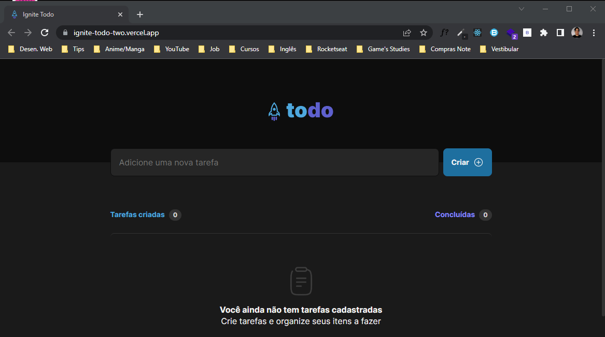

<h1 align="center">
    
</h1>

 <a href="#-demonstration">Demonstration</a> |
 <a href="#-deploy">Deploy</a> |
 <a href="#-technologies">Technologies</a> |
 <a href="#-layout">Layout</a> |
 <a href="#-clipboard-pré-requisitos">Clipboard</a> |
 <a href="#-settings">Settings</a>

---

O Ignite todo é um projeto para organizar suas tarefas do dia, permitindo a criação, conclusão ou exclusão das tarefas, e até mesmo a reorganização das tarefas por prioridade.

* Caso goste do projeto marque a estrelinha⭐ e compartilhe para me ajudar 👍, e me siga para ver outros projetos meus.

## 💻 Demonstration

    

    

## 💻 Deploy
- Clique no link a seguir para executar o projeto na sua máquina: <a target="_blank" href="https://ignite-todo-two.vercel.app/">Link</a>

## 🚀 Technologies
✔ [Vite](https://vitejs.dev/)
 

✔ [ReactJS](https://reactjs.org/)
 

✔ [TypeScript](https://www.typescriptlang.org/)
 

✔ [CSS-Modules](https://github.com/css-modules/css-modules)
 

✔ [Phosphor Icons](https://phosphoricons.com/)
 

✔ [uuid](https://www.npmjs.com/package/uuid)
 

✔ [React-beautiful-dnd](https://github.com/atlassian/react-beautiful-dnd)

## 🎨 Layout

- [Link no Figma](https://www.figma.com/file/i5BCUSBPRE4zXZEG2BzING/ToDo-List-(Copy)?node-id=0%3A1)

## 📋 Clipboard (Pré-requisitos)
- Antes de baixar o projeto você vai precisar ter instalado na sua máquina as seguintes ferramentas:
    * [Git](https://git-scm.com)
    * [NodeJS](https://nodejs.org/en/)
    * [Yarn](https://yarnpkg.com/) ou [NPM](https://www.npmjs.com/)

## ⚙ Settings
- Segue os comandos para baixar e executar o projeto na sua máquina:
    * `git clone` + `URL do Projeto`: clonar este repositório.
    * `cd Ignite-Todo`: acessa a pasta do projeto no terminal.
    * `yarn`: para baixar as dependências do projeto.
    * `yarn dev`: 
        - Executa o projeto em modo/ambiente de desenvolvimento.
        - Abra [http://localhost:3000](http://localhost:3000) para ver o projeto rodando no Navegador.
        - A página será recarregada se você fizer edições no código, e se tiver algum erro será mostrado no console.
    * `yarn build`: 
        - Compila a aplicação para a produção na pasta `build`.

## 📝 License
Esse projeto está sob a licença MIT. Veja o arquivo [LICENSE](LICENSE) para mais detalhes.

## ✍ Author

    Made with 💜 by PabloXT14

    
    

